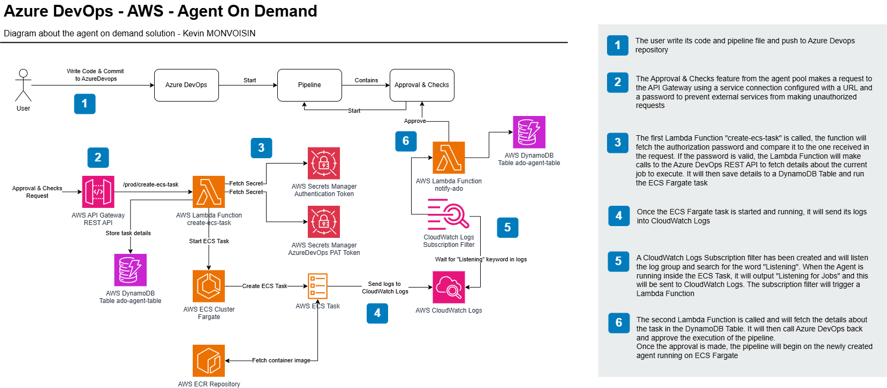

# Azure DevOps 🤝 AWS - On Demand agents using AWS, Terraform and Docker

This repository contains the required code to deploy the solution describe in the medium article available at 

# High Level Infrastructure



# Requirements
To use this solution, there are few requirements:

- Text Editor: there are files you need to change and modify to your needs, this is mandatory
- Terraform installed on your environment if you want to deploy the stack locally.
- Docker installed on your environment
- AWS Account
- Azure DevOps organization
- AWS CLI

## How to use

1. Create a PAT Token on Azure DevOps
2. Create a new Azure DevOps Agent pool
3. Modify the `terraform.tfvars` and specify your values. Use a public subnet, you can also use a private subnet but would have to also disable public IP assignment in the file `terraform/code/create-ecs-task/ecs.py`, modify `assignPublicIp = "ENABLED"` to `assignPublicIp = "DISABLED"`
4. Deploy the infrastructure using `terraform apply`
5. Fetch the API Gateway Invoke URL and the generated secret using AWS CLI
6. Create a new service connection on AzureDevOps, select `Generic` and enter the API Gateway URL and secret value from previous step
7. Create a new `Approval and check` in your Azure DevOps newly created agent pool
8. To try, you can use the following pipeline:
```yaml
trigger:
  branches:
    include:
    - '*'

stages:
- stage: test
  displayName: '[DEMO] AWS Agent On Demand'
  jobs:
  - job: RunAll
    displayName: '[DEMO] AWS Agent On Demand'
    pool:
      name: YOUR_AGENT_POOL
    timeoutInMinutes: 120
    steps:
    - task: CmdLine@2
      displayName: Hello World
      inputs:
        script: |
          echo "Hello, World!"
```
# Deployment

To deploy the infrastructure, you can run the command make deploy or run the following commands:
```bash
cd terraform
terraform init
terraform plan # Review results
terraform apply
```